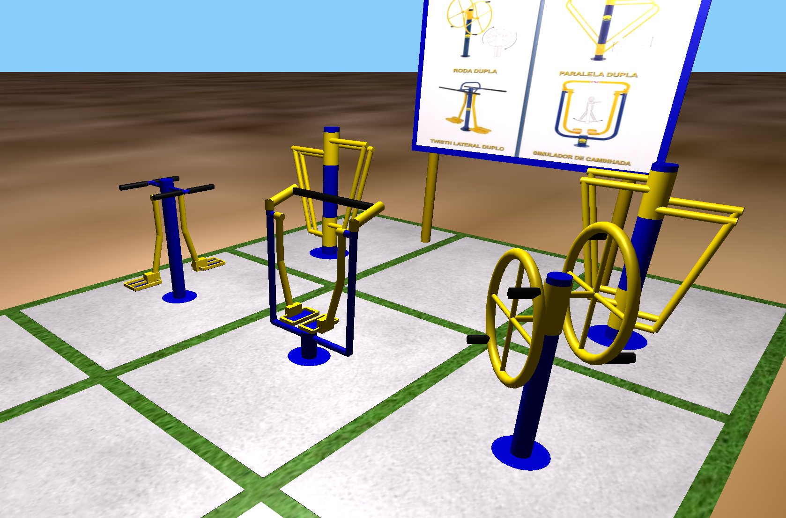

# Senior Playground (C++ / Modern OpenGL port)

A 3D rendered simulation of a **senior citizen outdoor fitness playground** (*academia ao ar livre*), originally built as a computer graphics assignment during university studies (~2015).

This repository is a **modernization** of the original [senior-playground](https://github.com/Guillhermm/senior-playground) project. It preserves the same scene geometry, textures, and animation logic, but replaces the deprecated OpenGL 1.x fixed-function pipeline and GLUT with:

- **OpenGL 3.3 Core Profile** with a custom Blinn-Phong GLSL shader
- **GLFW** for window management and input
- **GLEW** for extension loading
- **GLM** for math (matrices, vectors)
- Hand-written procedural mesh generation (cylinder, disk, box, torus, sphere, quad)
- Orbit camera with mouse drag and scroll-wheel zoom

**Author:** Guilherme Almeida Zeni  
**Original year:** ~2015 (Computer Graphics course)  
**C++ port:** 2021

---

## Screenshot



---

## Equipment in the scene

| Station | Description |
|---|---|
| Double parallel bars | Two height-adjustable parallel rail sets on a central post |
| Wheel spinner | Two large spinning wheels on a shared axle, with grip handles |
| Walking simulator | Oscillating foot pedals with lateral hand rails |
| Lateral twister | Opposing foot platforms that twist around a vertical axis |
| Information sign | Sign board on two posts (texture-mapped) |

---

## Controls

| Input | Action |
|---|---|
| Left-drag mouse | Orbit camera around scene |
| Scroll wheel | Zoom in / out |
| `A` | Animate all stations simultaneously |
| `1` | Animate twister only |
| `2` | Animate walking simulator only |
| `3` | Spin the wheel |
| `+` / `-` | Increase / decrease animation speed |
| `Enter` | Toggle debug grid overlay |
| `Q` / `Esc` | Quit |

---

## Building and running

### macOS (native)

Install prerequisites with Homebrew:

```bash
brew install cmake glfw glew glm
```

Then build:

```bash
cmake -B build -S .
cmake --build build
./build/senior-playground
```

Or without cmake:

```bash
make
./build/senior-playground
```

### Linux (native)

```bash
sudo apt-get install libglfw3-dev libglew-dev libglm-dev cmake build-essential
cmake -B build -S .
cmake --build build
./build/senior-playground
```

Or without cmake:

```bash
make
./build/senior-playground
```

### Docker (cross-platform, no local GL dependencies)

Requires [Docker Desktop](https://www.docker.com/products/docker-desktop/) and an X11 server.

**Linux:**

```bash
docker build -t senior-playground .
xhost +local:docker
docker run --rm \
    -e DISPLAY=$DISPLAY \
    -v /tmp/.X11-unix:/tmp/.X11-unix \
    senior-playground
```

**macOS** — install [XQuartz](https://www.xquartz.org/), then in XQuartz preferences enable *"Allow connections from network clients"*, and:

```bash
docker build -t senior-playground .
docker run --rm \
    -e DISPLAY=host.docker.internal:0 \
    senior-playground
```

---

## Project layout

```
senior-playground-cpp/
├── src/
│   ├── main.cpp        Entry point, GLFW setup, main loop
│   ├── scene.cpp/.h    Scene draw function, terrain, textures
│   ├── equipment.cpp/.h All fitness station draw functions
│   ├── camera.cpp/.h   Orbit camera
│   ├── mesh.cpp/.h     Procedural mesh generation (cylinder, disk, box, torus, sphere, quad, grid)
│   ├── renderer.h      Matrix-stack renderer wrapping the shader
│   ├── shader.cpp/.h   GLSL shader loader
│   ├── texture.cpp/.h  SGI RGB texture loader
│   ├── globals.h       Color constants, light parameters, animation/render state structs
│   └── image.c/.h      SGI RGB image loader (kept as C)
├── shaders/
│   ├── phong.vert      Vertex shader
│   └── phong.frag      Blinn-Phong fragment shader
├── assets/             Texture files (.rgb) — same as original project
├── docs/
│   └── ARCHITECTURE.md Technical design notes
├── CMakeLists.txt
└── Dockerfile
```

See [docs/ARCHITECTURE.md](docs/ARCHITECTURE.md) for a deeper technical explanation.
